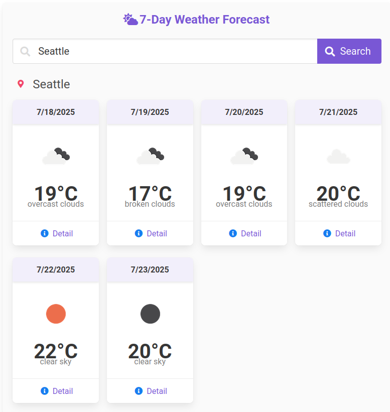
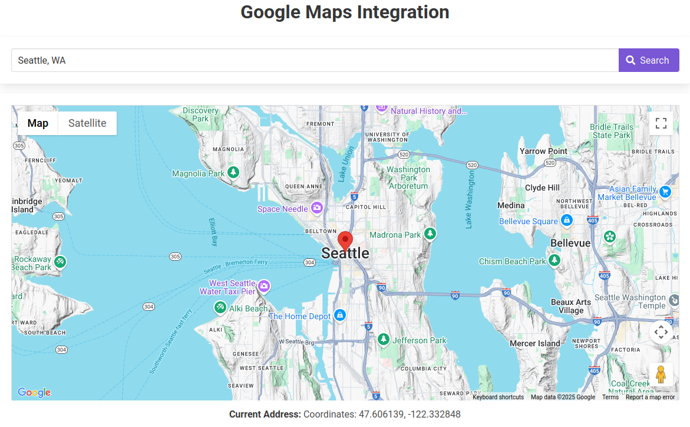
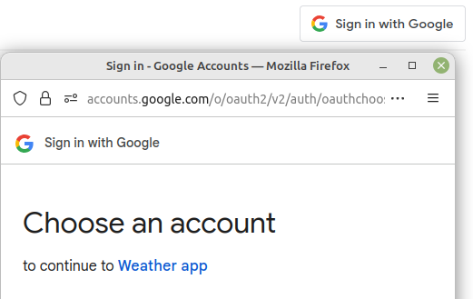

# Vue.js + Bulma + Buefy + Vite

This is a showcase project to integrate below popular framework, tool and components:
- Vue.js 3 and Vite
- The Bulma CSS framework and the lightweight Buefy framework
- The OpenWeatherMap API and Google Maps, demonstrating cross-page communication using Pinia
- Google Login functionality

## Technical Stack

```
 [Vue 3](https://vuejs.org/)
 [Vite](https://vitejs.dev/)
 [Buefy](https://buefy.org/)
 [Bulma CSS](https://bulma.io/)
 [Font Awesome](https://fontawesome.com/)
 [OpenWeatherMap API](https://openweathermap.org/api)
 [Google Maps API](https://developers.google.com/maps)
 [Google Login](https://developers.google.com/identity)
```

## Installation Guide

### Steps to Install

1. **Clone the repository**
   ```bash
   git clone https://github.com/yourusername/vuejs_bulma.git
   cd vuejs_bulma
   ```

2. **Install dependencies**
   ```bash
   npm install
   # or
   yarn install
   ```

3. **Set up environment variables**
   Create a `.env` file in the root directory and add the following variables:
   ```
   VITE_OPENWEATHER_API_KEY=your_openweather_api_key
   VITE_GOOGLE_MAPS_API_KEY=your_google_maps_api_key
   VITE_GOOGLE_CLIENT_ID=your_google_client_id
   ```
   (See the Environment Variables section below for more details)

4. **Start the development server**

   ```bash
   npm run dev or npx vite
   # or
   yarn dev
   ```

## Environment Variables

This project requires three API keys to function properly. You need to create a `.env` file in the root directory of the project and add the following variables:

1. **VITE_OPENWEATHER_API_KEY**
   - Used for weather data in the Weather component
   - Get your API key from [OpenWeatherMap](https://openweathermap.org/api)

2. **VITE_GOOGLE_MAPS_API_KEY**
   - Used for displaying maps in the Maps component
   - Get your API key from [Google Cloud Console](https://console.cloud.google.com/apis/credentials)
   - Enable the Maps JavaScript API in your Google Cloud Console

3. **VITE_GOOGLE_CLIENT_ID**
   - Used for Google Login functionality
   - Get your Client ID from [Google Cloud Console](https://console.cloud.google.com/apis/credentials)
   - Configure the OAuth consent screen and create OAuth 2.0 Client IDs
   - Add authorized JavaScript origins for your development and production environments such as `http://localhost:5173`

**Example .env file**
```
VITE_OPENWEATHER_API_KEY=abcdef123456789
VITE_GOOGLE_MAPS_API_KEY=AIzaSyA1B2C3D4E5F6G7H8I9J0K1L2M3N4O5P6
VITE_GOOGLE_CLIENT_ID=123456789-abcdefghijklmnopqrstuvwxyz.apps.googleusercontent.com
```


## Showcases







## Project Structure

A typical Vue.js project structure looks like this:

```
├── public/              # Static files
│   ├── index.html       # Main HTML template
│   └── style.css        # global style sheet
├── src/                 # Source files
│   ├── assets/          # Static assets (images, styles)
│   ├── components/      # Vue components
│   ├── views/           # Page-level components
│   ├── router/          # Vue router configuration
│   ├── stores/          # Pinia stores
│   ├── services/        # API services
│   ├── App.vue          # Root Vue component
│   └── main.js          # Application entry point
├── .env                 # Environment variables (not committed)
├── .gitignore           # Git ignore file
├── package.json         # Project dependencies and scripts
├── vite.config.js       # Vite configuration
└── README.md            # Project documentation
```